# Praktikum 1

**Langkah 1**

Ketik atau salin kode program berikut ke dalam fungsi ```main()```.

``` 
String test = "test2";
if (test == "test1") {
   print("Test1");
} else If (test == "test2") {
   print("Test2");
} Else {
   print("Something else");
}

if (test == "test2") print("Test2 again");
```

**Langkah 2:**

Silakan coba eksekusi (Run) kode pada langkah 1 tersebut. Apa yang terjadi? Jelaskan!
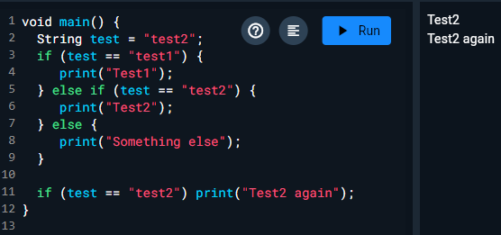
* The code outputs Test2 and Test2 again. 
* The code outputs that because the code define the test String as "test2", after that the code checks if the test variable is "test2" if yes then it outputs "Test2", lastly it checks if the test is "test2" again and so it outputs "Test2 again".

**Langkah 3:**

Tambahkan kode program berikut, lalu coba eksekusi (Run) kode Anda.

```
String test = "true";
if (test) {
   print("Kebenaran");
}
```

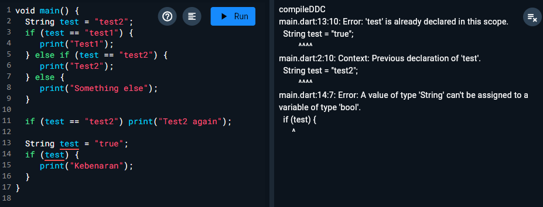

Apa yang terjadi ? Jika terjadi error, silakan perbaiki namun tetap menggunakan if/else.
* There is 2 errors 1 is that the variable test is already used in the first code, we can fix this by using a different variable name like twoest.
* The second error is that the if statements checks if the variable test is true, but because the true variable is a String then the code will return an error String can't be assigned to a variable type of bool, we can fix this by changing the variable type to boolean.
* here is the fixed code: 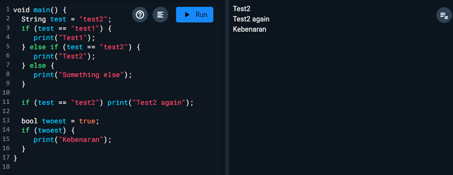

# Praktikum 2

**Langkah 1:**

Ketik atau salin kode program berikut ke dalam fungsi main().

```
while (counter < 33) {
  print(counter);
  counter++;
}
```

**Langkah 2:**

Silakan coba eksekusi (Run) kode pada langkah 1 tersebut. Apa yang terjadi? Jelaskan! Lalu perbaiki jika terjadi error.
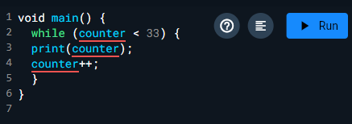
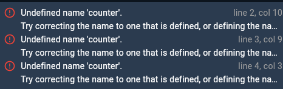
* There is an error because the counter variable is not defined, we can fix this by defining the counter variable
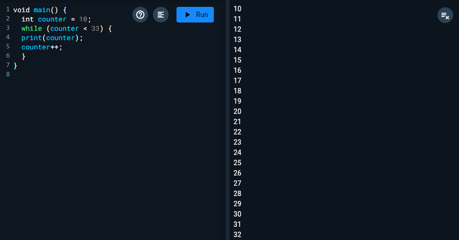

**Langkah 3:**

Tambahkan kode program berikut, lalu coba eksekusi (Run) kode Anda.

```
do {
  print(counter);
  counter++;
} while (counter < 77);
```

Apa yang terjadi ? Jika terjadi error, silakan perbaiki namun tetap menggunakan do-while.
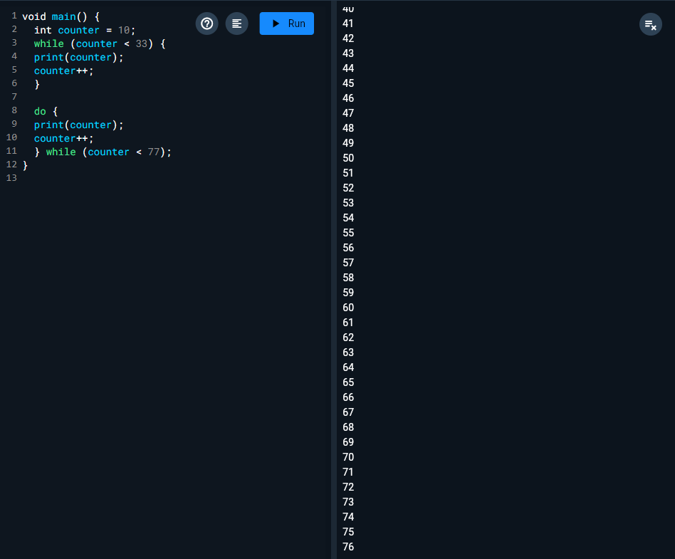
* There is no error.
* The function of the code is to print the counters value as long as the value of the counter is less than 77.

# Praktikum 3
**Langkah 1:**

Ketik atau salin kode program berikut ke dalam fungsi main().

```
for (Index = 10; index < 27; index) {
  print(Index);
}
```

**Langkah 2:**

Silakan coba eksekusi (Run) kode pada langkah 1 tersebut. Apa yang terjadi? Jelaskan! Lalu perbaiki jika terjadi error.

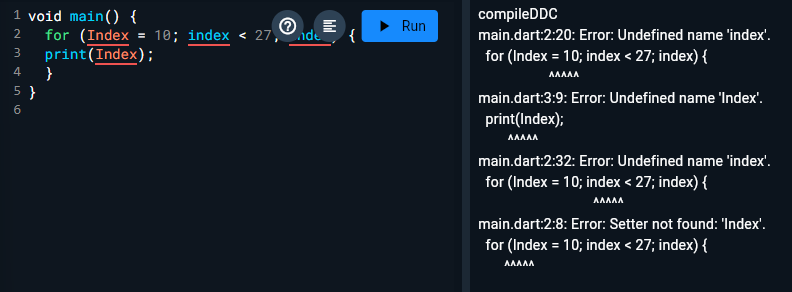

* There 3 errors, the first error is because the variable name is Index but in the condition its index, we can fix this by changing the name from Index to index.
* The second error is because the index variable is not defined correctly, we can fix it by defining it correctly as integer.
* The last error is caused because the increment statement is incomplete, we can fix it by adding ++ to complete the statement.
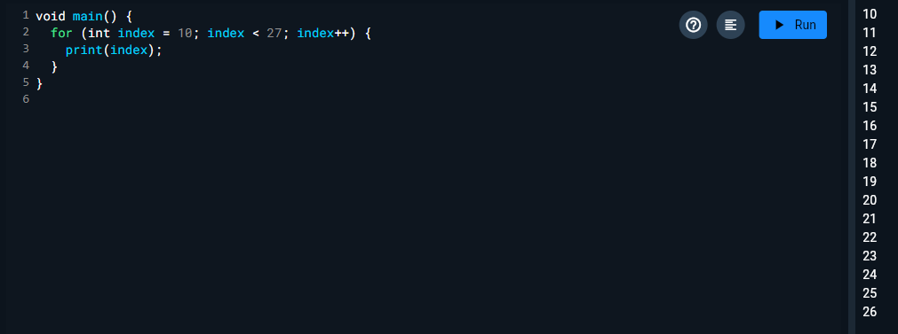


**Langkah 3:**

Tambahkan kode program berikut di dalam for-loop, lalu coba eksekusi (Run) kode Anda.

```
If (Index == 21) break;
Else If (index > 1 || index < 7) continue;
print(index);
```

Apa yang terjadi ? Jika terjadi error, silakan perbaiki namun tetap menggunakan for dan break-continue.
* There is a few errors, first the statement If and Else If should be typed if and else if, secondly the Index should be typed index.
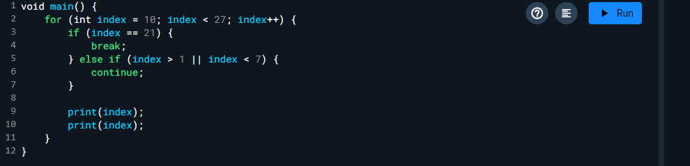
* There is no output because the else if checks if the index is bigger than 1 or lower than 7, if the condition is met it will execute continue which will skip all the code below it and continues to the next itteration, it will keep doing that because the value will always be bigger than 1.

# Tugas Praktikum

Buatlah sebuah program yang dapat menampilkan bilangan prima dari angka 0 sampai 201 menggunakan Dart. Ketika bilangan prima ditemukan, maka tampilkan nama lengkap dan NIM Anda.

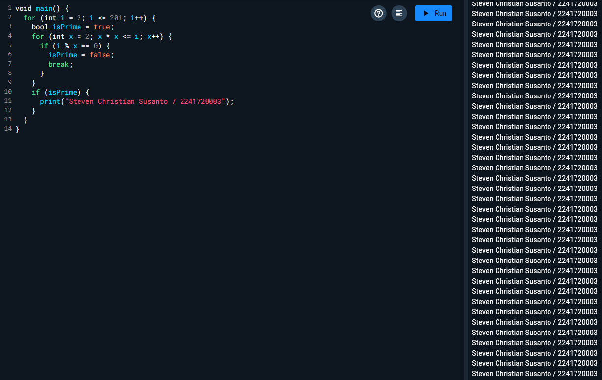